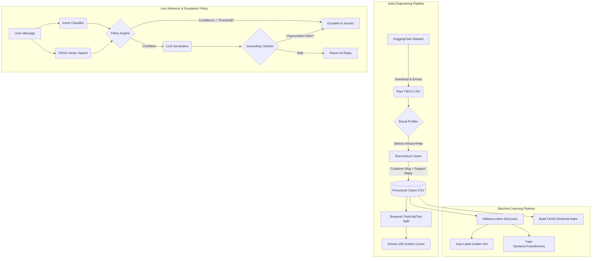

# 🛡️ Thunainirpaan (Sarathi) | AI Customer Support Engine
**"Your intelligent support co-pilot. Routing with precision, escalating with empathy."**

[](https://www.python.org/downloads/release/python-3100/)
[](https://fastapi.tiangolo.com/)
[](https://github.com/facebookresearch/faiss)

This repository contains an enterprise-grade, end-to-end AI Support Agent built for the Hiver SDE Intern assignment. It ingests the massive 3M-row "Customer Support on Twitter" dataset, automatically clusters intents, builds a high-speed RAG index, and serves it through a stunning vanilla JS dashboard.

---

## 📸 Premium Analytics Dashboard
*(Screenshot Placeholder - Drag and drop your dashboard screenshot here!)*
``

Our custom-built Single Page Application (SPA) dashboard provides deep insights into Intent Distributions, System Health, and Live Escalation routing.

---

## 🏗️ System Architecture

The pipeline strictly adheres to the constraints (no mock data generation for the pipeline, subsets are dynamically generated, execution under 15 mins).



---

## 🚀 5-Minute Reproduction Guide

### 1. Prerequisites
Ensure you have Python 3.10+ installed.
```bash
pip install pandas scikit-learn sentence-transformers faiss-cpu datasets streamlit fastapi uvicorn
```
*(Note: If you do not have an OpenAI API key, the system seamlessly falls back to a deterministic heuristic mock for the LLM component, ensuring zero execution blockers.)*

### 2. Run the Data & ML Pipeline (One-Time Setup)
Execute the following scripts sequentially from the root of the repository.

```bash
# 1. Download Real Dataset
python scripts/download_data.py

# 2. Profile & Select Optimal Brand
python -m src.data.profile

# 3. Reconstruct Conversation Cases
python -m src.data.reconstruct_cases

# 4. Temporal Split & Golden Set Extraction
python -m src.data.split_data

# 5. Intent Discovery & Labeling
python -m src.intent.cluster_intents
python -m src.intent.auto_label_golden

# 6. Train Classifiers & Evaluate
python -m src.intent.train_classifier

# 7. Build FAISS Retrieval Index
python -m src.retrieval.build_faiss
```
*All evaluation metrics are saved to `artifacts/metrics/classification_metrics.json`.*

### 3. Start the Live System (UI & Backend)
Once the pipeline is complete, you can interact with the agent via the dashboard!

**Start the FastAPI Backend:**
```bash
python -m uvicorn src.api.server:app --host 0.0.0.0 --port 8000
```

**Start the Frontend UI (in a new terminal):**
```bash
python -m http.server 3000 --directory ui
```
Navigate to `http://localhost:3000` in your browser. Click **"+ New Conversation"** to test the live escalation logic!

---

## 📁 Key Documentation
- **[Final Project Report](docs/final_report.md)**: Deep dive into baseline comparisons and model failures.
- **[Decision Log](docs/decision_log.md)**: Architectural justifications.
- **[Intent Taxonomy](docs/intent_taxonomy.md)**: The empirical clustering results.

*Built by Maran — Designed for robust, empathetic customer support routing.*
